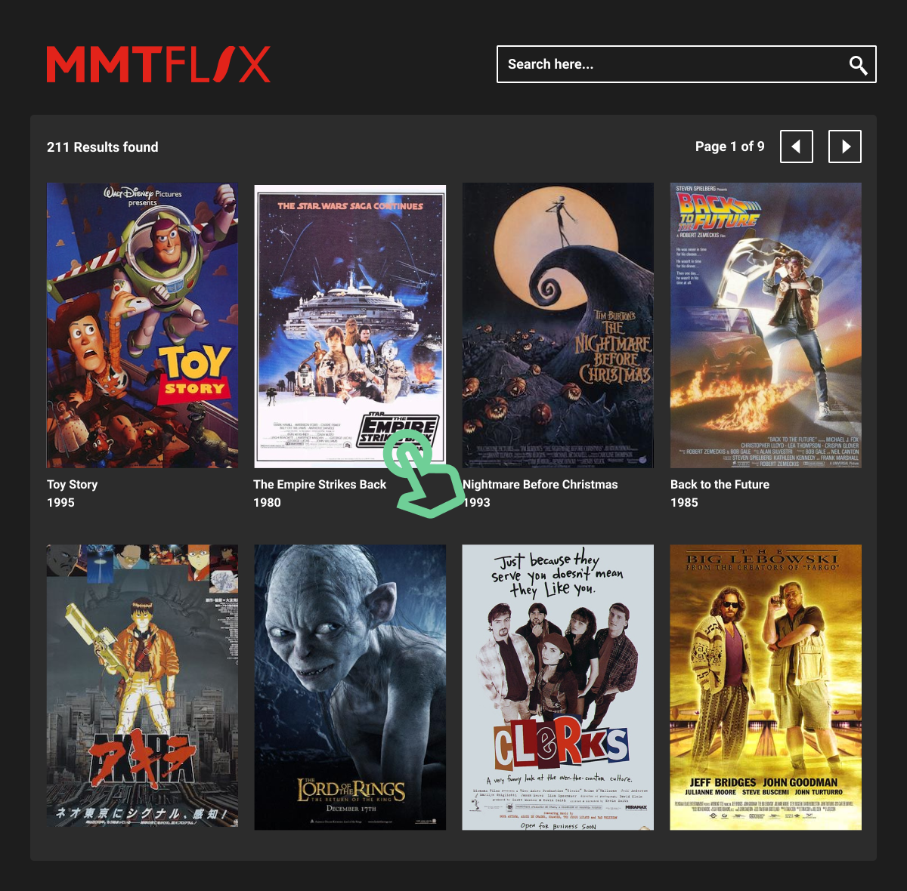

# Senior Front-end Engineer Code Challenge: MMT at the Movies! 

Welcome to the MMT Digital Front-end test! The following activity will give you the chance to showcase your skills as a front-end engineer. You’ll have **48 hours** to complete the test. Making it to the next stage of the process, we’ll talk through your code, and the decisions you’ve made.

Please read the entire document before you get started, to be sure of the requirements of the test:

We’d like you to implement an example of this, in the form of a movie database search, using the following design to guide your implementation:

**You can use [this Figma link](https://www.figma.com/proto/8InQTRWhd3JaqdnoY9TRxQ/Tech-Test?node-id=19%3A2&viewport=-766%2C78%2C0.6925315856933594&scaling=min-zoom) to get a higher definition version of the design**

## API Access 

For the API, you’re free to use any open, public movie API to be able to retrieve data to display. Open Movie Database and The Movie Database are examples of these. 

Some APIs do request a sign up process, if you’d prefer not to make use of these, you can always use a local JSON server instead: 

- [Open Movie Database](http://www.omdbapi.com/) 
- [The Movie Database](https://developers.themoviedb.org/3/getting-started/introduction) 
- [Local option - JSON-Server](https://github.com/typicode/json-server)

## Acceptance Criteria 

We’ve set up some open-ended acceptance criteria below to help you get started with your test submission: 

### **MovieSearch-01**

**AS A** user  
**I WANT** to search for a movie  
**SO THAT** I can find something to watch  

**GIVEN** I am on the search page  
**WHEN** I view the page  
**THEN** I can see a box with a button so I can search for a given movie title  

### **MovieSearch-02**

**AS A** user  
**I WANT** to see a list of movies based on my search  
**SO THAT** I can pick from the results  

**GIVEN** I am on the search page  
**WHEN** I have entered a search term  
**THEN** I can see a grid of movies, each showing the poster, title and year of release  

### **MovieSearch-03**

**AS A** user  
**I WANT** to see search results displayed in groups with pagination labelling at the top  
**SO THAT** the page remains performant and I can see which group I am looking at  

**GIVEN** I am on the search page  
**WHEN** the search results are displayed  
**THEN** I can see the results load, (showing x of x) to indicate the current paginated group being displayed  
**AND** I can click arrows to navigate between the groups of results  

### **MovieSearch-04**

**AS A** user  
**I WANT** to see more information about a film  
**SO THAT** I can decide whether to watch it  

**GIVEN** I am on the search page  
**WHEN** I click on a film  
**THEN** a modal appears, displaying the poster, title, year, plot, director, genre and cast of the selected film   

## Things we'd like to see: 

- Testing - both the functionality and performance of your submission 
- Use of modern JS frameworks like React, but keep in mind the position you are applying for and what we are looking for in the job description
- Use of modern techniques beyond plain CSS 
- A solution that is fully functioning and visually complete 
- Well-linted, consistent code 
- Accessibility considerations 
- Next gen JavaScript, ES+, used appropriately 
- Frequent Git use with clear commit messages 
- Progressive enhancement considerations 
- Use of types

## Getting started

You can use any boilerplate you’re used to for getting started. A simple and recommended way is to use  [Create React App (CRA)](https://github.com/facebook/create-react-app). 

To get started, run: - `npx create-react-app app && cd app && npm start`

## FAQs

### Am I allowed to Google stuff? 

Of course! Please work as you normally would during the day. 

### Shall I create branches? 

Ideally, yes. It’s expected that you will have made use of various branching strategies, so we would love to see that. 

### I’m finished, but feel like I have time to add some more to my project 

Amazing! Here are some things that we’ve come up with, but feel free to get creative:

- Allow searching based on genre or different criteria 
- Make use of lazy loading 
- Random movie finder 
- Add a method to buy or rent the film from somewhere like Amazon 
- Add another theme 
- Allow the layout to change from grid view to row view 
- Optimise for ultimate performance 
- Anything else that you can think of!